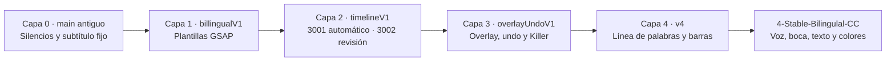
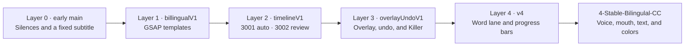

# CC-V1 · 4-Stable-Bilingulal-CC

Editor local para videos de clase. Quita los silencios, transcribe lo que se dice, corrige el español, traduce al inglés y quema los dos subtítulos sobre el video. No hay cuentas ni inicio de sesión: el archivo no sale de esta computadora. Quien cumpla el hardware de abajo puede repetir el mismo resultado.

## Cómo levantarlo

Hace falta Node.js 18 o más, Python 3.11, FFmpeg 8 y una GPU NVIDIA. En la raíz del clon:

```bash
npm install
npx cc-setup
```

`npx cc-setup` se detiene si falta la GPU, la VRAM, Python o FFmpeg 8. Después pide `DEEPSEEK_API_KEY`. Sin esa llave no instala el resto: DeepSeek es quien gasta tokens al corregir el español y al traducir al inglés. La llave queda solo en `backend/.env`, que no se sube al repositorio.

Cuando termina, abre dos pantallas sobre el mismo API:

- http://localhost:3001 procesa el lote solo.
- http://localhost:3002 se detiene para revisar el corte, el texto y la animación antes de quemar.
- http://127.0.0.1:8001 es el API.

## Hardware mínimo

La cadena es una sola GPU. No caben dos videos a la vez.

| Pieza | Mínimo | Por qué |
| --- | --- | --- |
| Sistema | Windows 10 u 11 | El FFmpeg de NVENC y el arranque están probados ahí. |
| GPU | NVIDIA con CUDA y NVENC | Whisper corre en CUDA. El quemado usa `h264_nvenc`. |
| VRAM | 8 GB | Whisper medium en float16 más el quemado. |
| RAM | 16 GB | El alineador y el navegador de captura conviven con la transcripción. |
| Disco | unos 3 GB libres para modelos | Whisper medium y el alineador MMS se bajan la primera vez. |
| Driver | serie 591 | FFmpeg 8 abre NVENC con ese driver. FFmpeg 9 pide uno más nuevo y este repo no lo usa. |
| FFmpeg | versión 8 | En `backend/tools/ffmpeg8` o en el PATH. |

Si la máquina no llega a eso, el repositorio se puede clonar, pero `npx cc-setup` no promete un video quemado.

## Qué hace cada herramienta

El lote no mezcla las herramientas al azar. Cada una entrega el reloj o el texto que la siguiente necesita.

1. **FFmpeg** corta los silencios del video de clase y deja un MP4 continuo. Más adelante superpone la franja animada con NVENC y copia el audio, para no mover la voz respecto de la imagen.
2. **faster-whisper** (modelo medium, CUDA, float16) oye ese audio ya cortado y propone una palabra con su inicio y su fin. Es la primera hipótesis, no el texto final.
3. **DeepSeek** reescribe el español y traduce al inglés. Gasta la llave del API. Conserva el inicio y el fin de cada frase; no inventa tiempos de palabra.
4. **Alineación forzada (MMS)** toma el texto ya corregido y lo vuelve a poner sobre el audio. Hace falta porque la frase corregida ya no coincide, palabra por palabra, con lo que dijo Whisper. Whisper se suelta de la GPU antes de cargar este modelo, para no tener dos redes a la vez.
5. **MediaPipe** mira la boca a 12 fotogramas por segundo. No adivina la palabra: si la boca se abre o se cierra a menos de 0,12 s del tiempo del audio, acerca ese borde. Si la imagen va corrida del audio más de 0,04 s, corre toda la línea.
6. **GSAP, dentro de Chromium (Playwright)**, pinta la frase. En Resalte el color cambia en el instante en que empieza la palabra, sin fundido. FFmpeg pega esa franja sobre el video.
7. **El frontend** muestra el corte, las frases y el letrero. No transcribe ni quema. El puerto 3002 deja corregir antes del quemado. El 3001 no se detiene.

El inglés no se alinea contra una voz en español. Copia el ritmo de lo que sí se dijo. El español sigue la palabra dicha.

## Por qué está cada función

- **Pop, Resalte y máquina de escribir.** Tres lecturas distintas. Resalte es la que marca la palabra que suena.
- **ON de colores por idioma.** El español sale en blanco con resalte verde. El inglés sale en blanco con resalte azul (`#0094FF`). Así las dos líneas no se confunden. Se puede apagar y volver al blanco y amarillo compartidos.
- **Una sola línea por idioma.** Si la frase no cabe, la letra se achica. Un salto de renglón parte la frase y esconde el resalte.
- **Listas de más de tres comas.** «día, semana, mes, año, turno» deja de ser una frase de varios segundos. Cada trozo es su propio subtítulo, con su propio tiempo, para que el resalte no se quede pegado en la última palabra.
- **Asteriscos.** `*ahora*` se ve y se quema en mayúsculas. El texto guardado conserva los asteriscos.
- **Revisión, Continue y Killer.** A veces el corte o la frase hay que verlos antes de gastar el quemado. Continue sigue. Killer saca de la cola el video que dejó la revisión trabada.
- **Cronómetro y dos barras.** El reloj corre desde el primer paso hasta que los archivos se pueden descargar. La barra de arriba es el lote. La de abajo es el paso que está trabajando: corte, palabra de Whisper, frase, signo, boca o quemado.

## Hitos

Cada capa se quedó en el repositorio. La siguiente no borra la anterior.



| Capa | Qué se sumó, y por qué |
| --- | --- |
| 0 | Cortar silencios, transcribir y quemar un subtítulo fijo. El video de clase tenía huecos y el texto no podía depender de un servidor. |
| 1 · `billingualV1` | Pop, Resalte y máquina de escribir, con fuente, color, posición y tamaño. Un subtítulo quieto no enseña qué palabra está sonando. El video limpio se conserva. |
| 2 · `timelineV1` | Modo automático en el puerto 3001 y revisión en el 3002, los dos contra el API 8001. Quemar sin mirar el texto gastaba el lote entero cuando una frase estaba mal. |
| 3 · `overlayUndoV1` | El tramo que suena se marca en el corte. Ctrl+Z deshace hasta cinco cambios. Continue suelta la revisión y Killer saca el video atorado. Un Quitar accidental no debía obligar a empezar de cero. |
| 4 · `v4` | La revisión sigue la frase que suena: línea de palabras, letrero en el video y recorte de un fotograma. El buscador salta a la frase. `*texto*` pasa a mayúsculas. Cronómetro en milisegundos y dos barras de progreso. Sin eso no se sabía si el lote seguía vivo. |
| 5 · `4-Stable-Bilingulal-CC` | El texto corregido se alinea otra vez con la voz, la boca corrige el borde y el resalte cambia sin fundido. Español e inglés tienen colores propios. Las listas largas de comas se parten. Cada idioma cabe en una sola línea. Esta es la versión de `main`. |

## Scope

Hecho en esta versión: corte de silencios, transcripción, corrección en español, traducción al inglés, revisión, quemado de los dos idiomas, sincronía de voz, boca y texto, y colores separados.

Pendiente: una lista de videos en forma de pila. El operador suelta varios archivos y la máquina los procesa uno por uno, nunca a la vez. Hoy el hardware no alcanza para dos cadenas en paralelo: una sola GPU transcribe, alinea y quema. Esa pila es el siguiente trabajo. No está en esta versión.

## Lo que no se sube

`backend/.env`, el entorno de Python, `backend/data/`, los modelos bajados, `node_modules` y las carpetas de Next. Quien clona el repo crea eso en su máquina con `npx cc-setup`.

---

# CC-V1 · 4-Stable-Bilingulal-CC

A local editor for class videos. It removes silences, transcribes the speech, corrects the Spanish, translates it into English, and burns both captions onto the picture. There are no accounts and no sign-in: the file stays on this computer. Anyone who meets the hardware below can repeat the same result.

## How to start it

Node.js 18 or newer, Python 3.11, FFmpeg 8, and an NVIDIA GPU are required. From the clone:

```bash
npm install
npx cc-setup
```

`npx cc-setup` stops when the GPU, the VRAM, Python, or FFmpeg 8 is missing. It then asks for `DEEPSEEK_API_KEY`. Without that key it does not install the rest: DeepSeek is what spends tokens to correct the Spanish and translate into English. The key is written only to `backend/.env`, which is not committed.

Two screens share one API:

- http://localhost:3001 runs the batch on its own.
- http://localhost:3002 stops so the cut, the text, and the animation can be checked before the burn.
- http://127.0.0.1:8001 is the API.

## Minimum hardware

The chain uses one GPU. Two videos do not fit at once.

| Piece | Minimum | Why |
| --- | --- | --- |
| OS | Windows 10 or 11 | The NVENC FFmpeg build and the launcher are proven there. |
| GPU | NVIDIA with CUDA and NVENC | Whisper runs on CUDA. The burn uses `h264_nvenc`. |
| VRAM | 8 GB | Whisper medium in float16, plus the burn. |
| RAM | 16 GB | The aligner and the capture browser sit beside the transcription. |
| Disk | about 3 GB free for models | Whisper medium and the MMS aligner download on first use. |
| Driver | 591 series | FFmpeg 8 opens NVENC with that driver. FFmpeg 9 wants a newer one, and this repo does not use it. |
| FFmpeg | version 8 | Under `backend/tools/ffmpeg8`, or on the PATH. |

The repository can be cloned on a smaller machine. `npx cc-setup` does not promise a burned video there.

## What each tool does

The batch does not mix the tools at random. Each one hands the clock or the text to the next.

1. **FFmpeg** cuts the silences out of the class video and leaves one continuous MP4. Later it lays the animated strip on top with NVENC and copies the audio, so the voice does not move against the picture.
2. **faster-whisper** (medium, CUDA, float16) listens to that cut audio and proposes each word with a start and an end. That is the first guess, not the final text.
3. **DeepSeek** rewrites the Spanish and translates it into English. It spends the API key. It keeps each cue's start and end. It does not invent word times.
4. **Forced alignment (MMS)** takes the corrected text and places it on the audio again. The corrected sentence no longer matches Whisper word for word. Whisper is released from the GPU before this model loads, so two networks are not resident together.
5. **MediaPipe** watches the mouth at 12 frames per second. It does not guess the word. If the mouth opens or closes within 0.12 s of the audio time, that edge moves closer. If the picture is more than 0.04 s off the audio, the whole line shifts.
6. **GSAP, inside Chromium (Playwright)**, paints the line. In Highlight the color changes at the instant the word starts, with no fade. FFmpeg lays that strip on the video.
7. **The frontend** shows the cut, the lines, and the caption. It does not transcribe or burn. Port 3002 lets a person correct the job before the burn. Port 3001 does not stop.

The English line is not aligned against Spanish speech. It copies the rhythm of the words that were actually said. The Spanish line follows those spoken words.

## Why each feature is there

- **Pop, Highlight, and typewriter.** Three ways to read a line. Highlight is the one that marks the word being spoken.
- **Per-language colors, ON by default.** Spanish is white with a green highlight. English is white with a blue highlight (`#0094FF`). The two lines stay distinct. Turning the switch off returns to the shared white and yellow.
- **One line per language.** If the sentence does not fit, the type gets smaller. A line break splits the sentence and hides the highlight.
- **Lists of more than three commas.** "day, week, month, year, shift" stops being one cue of several seconds. Each piece becomes its own caption, with its own time, so the highlight does not stick on the last word.
- **Asterisks.** `*now*` is shown and burned in uppercase. The stored text keeps the asterisks.
- **Review, Continue, and Killer.** Sometimes the cut or the line has to be seen before spending the burn. Continue goes on. Killer removes the video that left the review stuck.
- **Timer and two bars.** The clock runs from the first step until the files can be downloaded. The upper bar is the whole job. The lower bar is the step that is working: a cut, a Whisper word, a sentence, a mark, the mouth, or the burn.

## Milestones

Each layer stayed in the repository. The next one does not erase the previous one.



| Layer | What was added, and why |
| --- | --- |
| 0 | Cut silences, transcribe, and burn a fixed subtitle. The class video had gaps, and the text could not depend on a server. |
| 1 · `billingualV1` | Pop, Highlight, and typewriter, with font, color, position, and size. A still subtitle does not show which word is being spoken. The clean video is kept. |
| 2 · `timelineV1` | Automatic mode on port 3001 and review on port 3002, both against API 8001. Burning without reading the text spent the whole batch when one line was wrong. |
| 3 · `overlayUndoV1` | The span that is playing is marked on the cut. Ctrl+Z undoes up to five edits. Continue releases the review and Killer removes the stuck video. An accidental delete should not force a restart. |
| 4 · `v4` | Review follows the spoken line: a word lane, an on-video caption, and a one-frame trim. Search jumps to the phrase. `*text*` becomes uppercase. A millisecond timer and two progress bars. Without them it was unclear whether the batch was still working. |
| 5 · `4-Stable-Bilingulal-CC` | The corrected text is aligned to the voice again, the mouth corrects the edge, and the highlight changes with no fade. Spanish and English have their own colors. Long comma lists are split. Each language fits on one line. This is the `main` version. |

## Scope

Done in this version: silence cutting, transcription, Spanish correction, English translation, review, a bilingual burn, voice-mouth-text sync, and separate colors.

Still to do: a stack of videos. The operator drops several files and the machine processes them one by one, never at the same time. The hardware cannot run two chains in parallel: one GPU transcribes, aligns, and burns. That stack is the next piece of work. It is not in this version.

## What is not in the repository

`backend/.env`, the Python environment, `backend/data/`, downloaded models, `node_modules`, and the Next build folders. A clone creates those locally with `npx cc-setup`.
