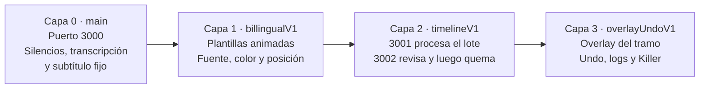
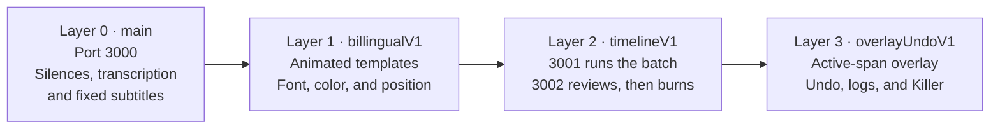

# CC-V1

Editor local por lotes para videos de clase. Quita los silencios, transcribe la lección y quema subtítulos para que los estudiantes los vean en YouTube y en redes. El trabajo ocurre en esta computadora: no hay cuentas ni inicio de sesión. Cada capa añade una capacidad y deja la anterior en su sitio.

## Mapa

| Capa | Qué aporta |
| --- | --- |
| 0 · `main` | Corta silencios, transcribe con Whisper, corrige español e inglés con DeepSeek y quema el texto. Puerto 3000, API 8000. |
| 1 · `billingualV1` | Quema tres animaciones: Pop, Resalte y Máquina de escribir. Se eligen fuente, colores, posición y tamaño. El video limpio se conserva. |
| 2 · `timelineV1` | El lote sigue solo, o se detiene para corregir el corte, el texto y la animación antes de quemar. El idioma puede ser español, inglés o ambos. El puerto 3002 abre la revisión; el 3001 procesa sin esa pantalla. Los dos usan el API 8001. |
| 3 · `overlayUndoV1` | En el corte, el tramo que suena queda marcado con un overlay y un triángulo. Ctrl+Z deshace hasta cinco cambios, para recuperar un Quitar accidental. Los logs del motor quedan a la derecha: Continue suelta la revisión y Killer saca de la cola el video que la tiene trabada. |

Las notas de cada capa están en [Releases](https://github.com/Juan9201/CC-V1/releases).

---

# CC-V1

A local batch editor for class videos. It removes silences, transcribes the lesson, and burns subtitles so students can watch them on YouTube and social networks. The work stays on this computer: there are no accounts and no sign-in. Each layer adds a capability and leaves the previous one in place.

## Map

| Layer | What it adds |
| --- | --- |
| 0 · `main` | Cuts silences, transcribes with Whisper, corrects Spanish and English with DeepSeek, and burns the text. Port 3000, API 8000. |
| 1 · `billingualV1` | Burns three animations: Pop, Highlight, and Typewriter. Font, colors, position, and size are chosen in the form. The clean video is kept. |
| 2 · `timelineV1` | The batch can run on its own, or stop so the cut, the text, and the animation can be corrected before the burn. The track can be Spanish, English, or both. Port 3002 opens the review; port 3001 processes without that screen. Both use API 8001. |
| 3 · `overlayUndoV1` | On the cut, the span that is playing is marked with an overlay and a triangle. Ctrl+Z undoes up to five changes, so an accidental Quitar can be restored. Engine logs sit on the right: Continue releases the review, and Killer removes the video that is holding the queue. |

The note for each layer is in [Releases](https://github.com/Juan9201/CC-V1/releases).
